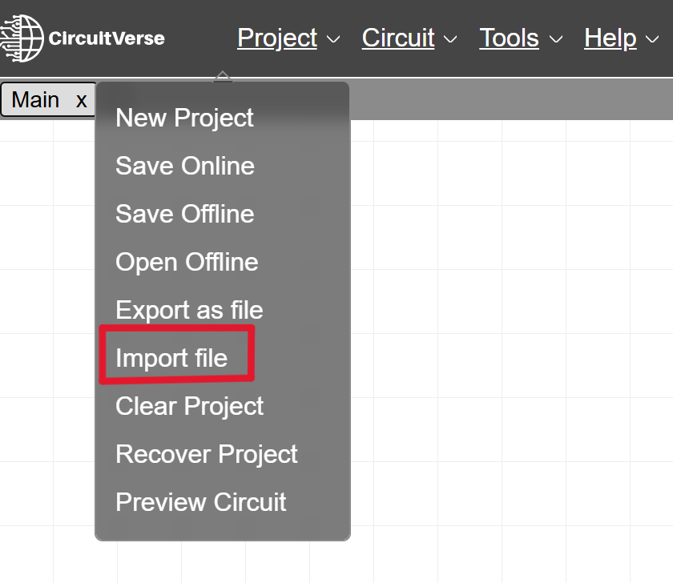
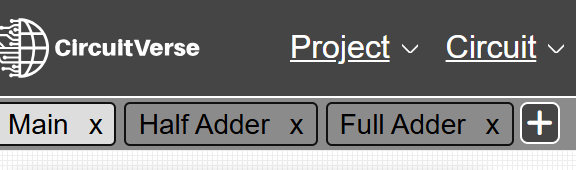

# Pengujian Gerbang Logika Menggunakan CircuitVerse

## Deskripsi

Repositori ini berisi file **Pengujian Gerbang Logika** yang dibuat menggunakan web simulator [CircuitVerse](https://circuitverse.org/). Pengujian ini dilakukan untuk memahami konsep dasar gerbang logika, cara kerja rangkaian digital, serta memenuhi Tugas Ujian Akhir Mata Kuliah **Arsitektur Komputer**.

## Pengujian yang Dilakukan

Pengujian pada repositori ini meliputi:

1. Gerbang Logika Dasar
   - `AND`
   - `OR`
   - `NOT`

2. Gerbang Logika Universal
   - `NAND`
   - `NOR`

3. Gerbang Logika Kombinasi
   - `XOR`
   - `XNOR`

4. Half Adder
   - Metode `XOR` dan `AND`
   - Metode `AND`, `OR`, dan `NOT`
   - Metode `NAND` Only
   - Metode `NOR` Only

5. Full Adder

## Daftar File

| Nama File                  | Keterangan                                                      |
| -------------------------- | --------------------------------------------------------------- |
| `LogicGates.cv`            | Berisi pengujian gerbang logika dasar, universal, dan kombinasi |
| `TestingLogicGates.cv`     | Berisi rangkaian dan pengujian Half Adder                       |
| `halfadderandfulladder.cv` | Berisi rangkaian Half Adder dan Full Adder                      |

## Langkah Mencoba Hasil Pengujian

1. Unduh file `.cv` yang tersedia pada repositori ini.

2. Masuk ke web simulator [CircuitVerse](https://circuitverse.org/simulator).

3. Pada menu `Project`, pilih `Import File`.

   

4. Import salah satu file, seperti `LogicGates.cv`, `TestingLogicGates.cv`, atau `halfadderandfulladder.cv`.

5. Jika rangkaian berhasil muncul pada simulator, maka proses import telah berhasil.

6. Anda bisa melihat beberapa rangkaian circuit pada subcircuit untuk di uji.

   

7. Jalankan pengujian dengan mengubah nilai input pada rangkaian, lalu amati perubahan output yang dihasilkan.

## Tujuan Pengujian

Pengujian ini dilakukan untuk memahami cara kerja gerbang logika dalam sistem digital. Selain itu, pengujian ini juga bertujuan untuk melihat bagaimana gerbang logika dapat dikombinasikan menjadi rangkaian yang lebih kompleks, seperti Half Adder dan Full Adder.

## Catatan

File `.cv` hanya dapat dibuka melalui CircuitVerse. Pastikan file berhasil di-import sebelum melakukan pengujian rangkaian.
